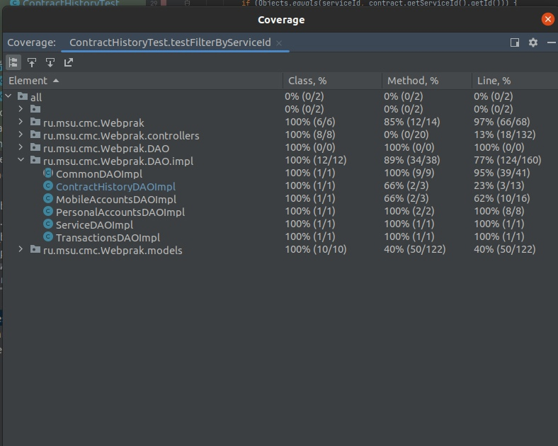
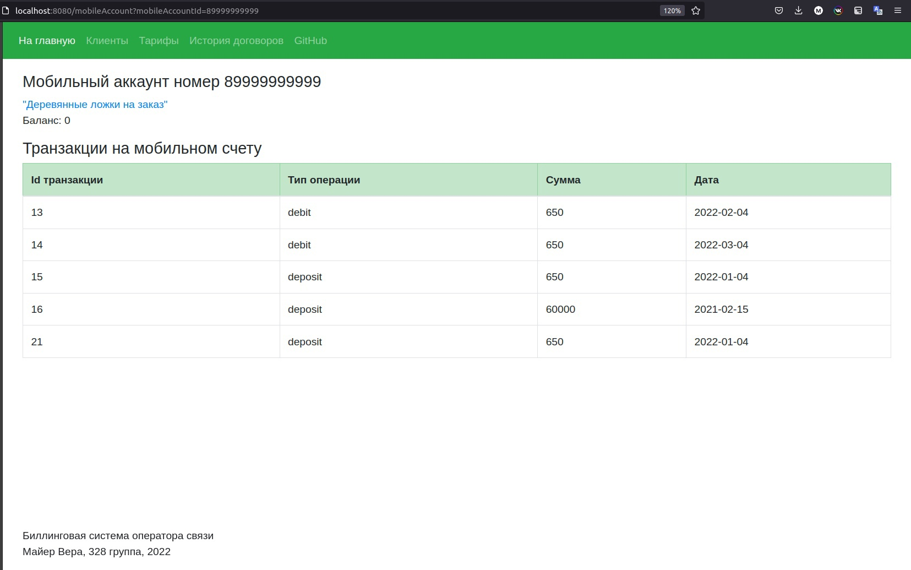

# Биллинговая база оператора связи

# 1 этап

## Схема Базы данных

## Описание страниц

### Меню: 
+ На главную
+ Клиенты
+ Тарифы
+ История договоров

### Главная

Страница с описанием сайта 

### Услуги

Таблица с услугами, переходы на страницы просмотра услуг

Кнопка "Добавить услугу": *Ссылка на страницу "Создание или редактирование услуги"*

### Клиенты

Таблица с клиентами, переходы на просмотр клиента

Добавление клиента – переход на  страницу создания клиента

### История 
Таблица со всеми договорами об оказании услуг

Фильтрация  (по id услуги)

### Просмотр услуги

Информация:
+ Название услуги
+ Количество подключаемых устройств
+ Минуты
+ SMS
+ Интернет
+ Стоимость
+ Максимальный кредит

Кнопка "Удалить услугу"

Кнопка "Редактировать услугу": *Ссылка на страницу "Создание или редактирование услуги"*

### Создание или редактирование услуги

Поля для заполнения:
+ Название услуги
+ Количество подключаемых устройств
+ Минуты
+ SMS
+ Интернет
+ Стоимость
+ Максимальный кредит

Кнопка "Сохранить"

### Просмотр информации о клиенте

Информация:
+ Тип клиента
+ Имя или Название фирмы
+ Отчество
+ Фамилия
+ Электронный адрес
+ Мобильные счета клиента *Ссылки на страницы мобильных счетов*

Кнопка "Удалить клиента"

Кнопка "Редактировать клиента": *Ссылка на страницу "Создание и редактирование информации о клиенте"*

### Создание и редактирование информации о клиенте

Поля для заполнения:
+ Тип клиента
+ Имя или Название фирмы
+ Отчество
+ Фамилия
+ Электронный адрес

### Просмотр  информации о мобильном счёте

Информация:
+ Номер телефона
+ Владелец: *Ссылка на страницу "Просмотр информации о клиенте"*
+ Баланс
+ Таблица с денежными операциями

## Сценарии использования

#### Получение списка клиентов

Выбор в меню "Клиенты"

#### Регистрация поступлений на счет и списаний со счёта
    
Выбор в меню "История договоров" -> Переход на страницу "Просмотр информации о мобильном счёте", просмотр журнала транзакций
    
#### Добавление нового клиента

Выбор в меню "Клиенты" -> Добавить клиента –> Переход на пустую страницу создания клиента, заполнение полей -> Нажатие кнопки Сохранить

#### Удаление  клиента

Выбор в меню "Клиенты" -> Выбор клиента из таблицы, переход на страницу "Просмотр информации о клиенте" -> Удалить клиента

#### Редактирование услуги

Выбор в меню "Тарифы" -> Выбор услуги из таблицы, переход на страницу Информация об услуге -> Редактировать услугу -> Изменение полей -> Нажатие кнопки Сохранить

# 2 этап

#### Написание классов, DAO методов,

### Тестирование методов. Покрытие:

# 3 этап

### Web интерфейс

#### Написание страниц, контроллеров

### Главная

### Услуги

### Просмотр услуги

### Клиенты

### Просмотр информации о клиенте

### История

### Просмотр  информации о мобильном счёте

### Создание информации о клиенте

### Редактирование информации о клиенте

### Удаление клиента

### Фильтр договоров по услуге

